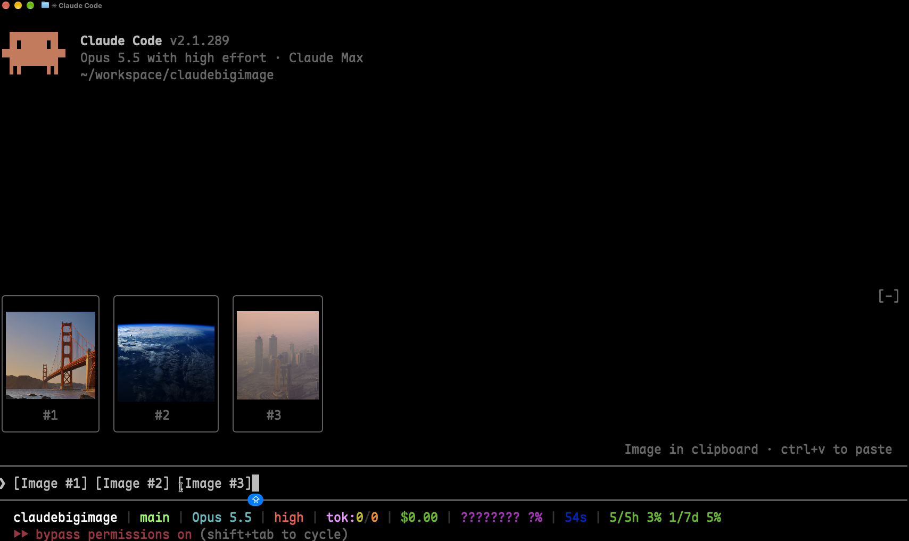

# Claude Big Image

讓你在 Claude Code 貼上的圖片，直接以大尺寸預覽顯示在提示框上方，不再只有光禿禿的 `[Image #1]` 標籤或小小的縮圖。

本專案 fork 自 [jarrodwatts/claude-image-view](https://github.com/jarrodwatts/claude-image-view)，把預覽放大（預設最大 20 列 × 80 欄，原版是 6 × 32），尺寸也可以自己設定，並加上可停靠在對話旁的大圖預覽 Pane。

[](LICENSE)



## 安裝

在 Claude Code 裡執行：

```
/plugin marketplace add joshhu/claudebigimage
/plugin install image-view@claudebigimage
/reload-plugins
```

這樣就完成了。在提示框貼上圖片，預覽就會出現在輸入框上方。

如果你也裝了原版的 `image-view@claude-image-view`，請先停用，避免兩個同時畫圖。

<details>
<summary><strong>想用終端機指令安裝？</strong></summary>

```bash
claude plugin marketplace add joshhu/claudebigimage
claude plugin install image-view@claudebigimage
```

接著在 session 裡執行 `/reload-plugins`，或開一個新的 session。

</details>

## 使用起來的樣子

貼上一張或多張圖片，提示框上方會出現一排預覽，每張都標上對應的標籤編號：

```
╭────────────────────────╮ ╭────────────╮
│                        │ │            │
│      (screenshot)      │ │  (photo)   │
│                        │ │            │
│           #1           │ │     #2     │
╰────────────────────────╯ ╰────────────╯
❯ 為什麼這裡的標題沒對齊 [Image #1] vs [Image #2]
```

- **用 Pane 顯示大圖。** 終端機夠寬（144 欄以上）時，貼上的圖片會自動在「Image preview」Pane 裡打開：全螢幕模式下停靠在對話旁邊、從頂到底整個高度都能用，否則放在提示框上方。每張圖預設最大 20 列高、80 欄寬（見[設定](#設定)）。
- **`/image-view` 隨時打開。** 終端機比較窄時，圖片會改顯示在提示框上方那一排；執行 `/image-view` 可以在任何寬度打開 Pane。手動關掉 Pane 後，要等你貼上不同的圖片才會再自動打開。
- **一貼上就顯示。** 不用再多按一個鍵。
- **保持原本比例。** 寬的截圖維持寬的，手機直式截圖維持直的。
- **一定放得進畫面。** 預覽會縮到剛好放得進提示框上方的空間（而且不超過終端機高度的三分之二），不會捲動或被切掉。
- **送出後自動清除。** 提示送出（或刪掉標籤）之後，預覽和 Pane 都會消失。

## 設定

預覽的最大尺寸由兩個選項控制。可以在 `/plugin` 的設定選單修改，或寫在 `~/.claude/settings.json` 的 `pluginConfigs` 底下：

| 選項 | 預設值 | 說明 |
| --- | --- | --- |
| `maxHeight` | `20` | 預覽最多幾列高（1–255）。 |
| `maxWidth` | `80` | 預覽最多幾欄寬（4–255）。 |

預覽一定會縮到終端機放得下的大小，所以設大一點也沒關係。把 `maxHeight` 設成 `6`、`maxWidth` 設成 `32`，就是原版的小縮圖。

## 運作原理

Claude Code 會把每張貼上的圖片存到這個 session 的快取資料夾 `<tmp>/<project>/<session>/images/<n>.png`，並在提示框放一個 `[Image #n]` 標籤。Claude Big Image 是一個 [mod](https://code.claude.com/docs/en/plugins/mods/overview)：

1. 每 200ms 讀一次提示框內容，找出 `[Image #n]` 標籤。之所以用計時器輪詢，是因為貼上圖片不會觸發編輯事件。
2. 對每個標籤找到快取的 PNG，從 PNG 檔頭讀出圖片尺寸。
3. 用 Claude Code 的 `Image` 元件把圖片畫在 Pane 裡；Pane 沒辦法顯示時，改畫在提示框上方。圖片檔由終端機自己讀取，圖片資料不會經過這個 mod。

## 安全性

Claude Big Image 只在本機運作，不發出任何網路請求，也不寫入任何檔案。它只會讀取提示框內容、列出 Claude Code 的暫存資料夾來找到目前 session 的圖片快取，以及讀取每張圖片開頭的幾個位元組。如果沒有設定 `CLAUDE_CODE_TMPDIR`，它會執行一次 `id -u` 來找出預設的暫存資料夾。

對這個 repo 執行 `claude plugin validate`，可以看到它掛了哪些事件、呼叫了哪些 API。

## 系統需求

- Claude Code v2.1.287 以上（支援 mods）
- macOS 或 Linux
- 支援 kitty 圖片協定的終端機，例如 [Ghostty](https://ghostty.org) 或 [kitty](https://sw.kovidgoyal.net/kitty/)

其他終端機只會在每個框裡顯示 `[Image #n]` 文字，不會顯示圖片。Claude 桌面版本身就會預覽貼上的圖片，所以這個 mod 在那裡不會畫任何東西。

## 疑難排解

**圖片還是很小。** 終端機視窗太小，騰不出空間。全螢幕模式下，提示框上方的區域最多只有終端機高度的一半，25 列的視窗只剩大約 2 列給圖片。把視窗放大，或執行 `/image-view` 改用預覽 Pane 顯示（Pane 要 144 欄以上才會自動打開；用 `/image-view` 開過一次之後，110 欄以上就會自動打開）。

**貼上之後什麼都沒出現。** 執行 `/plugin`，確認分頁下方那行灰字有列出 `image-view` 是啟用中的 mod。沒有的話，執行 `/reload-plugins`。

**框裡顯示「no preview」。** mod 找不到快取的圖片檔，可能是 Claude Code 改了貼上圖片的存放位置。請附上你的 Claude Code 版本[開一個 issue](https://github.com/joshhu/claudebigimage/issues)。

**框裡顯示 `[Image #1]` 文字而不是圖片。** 你的終端機不支援 kitty 圖片協定，請參考[系統需求](#系統需求)。

**在 agent view 或背景 session 裡，就算用 Ghostty 或 kitty 也只顯示 `[Image #1]` 文字。** Claude Code 會在背景 session 關閉終端機圖片。如果你是從支援 kitty 圖片協定的終端機連進去，可以在 `~/.claude/settings.json` 的 `env` 區塊把它打開，再開一個新的 session：

```json
"env": { "CLAUDE_CODE_FORCE_TERMINAL_IMAGES": "1" }
```

## 開發

```bash
git clone https://github.com/joshhu/claudebigimage
cd claudebigimage

# 不安裝，只在這次 session 載入
claude --plugin-dir .

# 檢查並執行測試
claude plugin validate .
claude plugin test .
```

Claude Code 第一次載入這個 mod 時，會把 API 型別寫進 `.claude-plugin/types/`，之後就可以用 `tsc -p .` 做型別檢查。

## 授權

MIT，詳見 [LICENSE](LICENSE)。本專案改自 Jarrod Watts 的 [claude-image-view](https://github.com/jarrodwatts/claude-image-view)。
